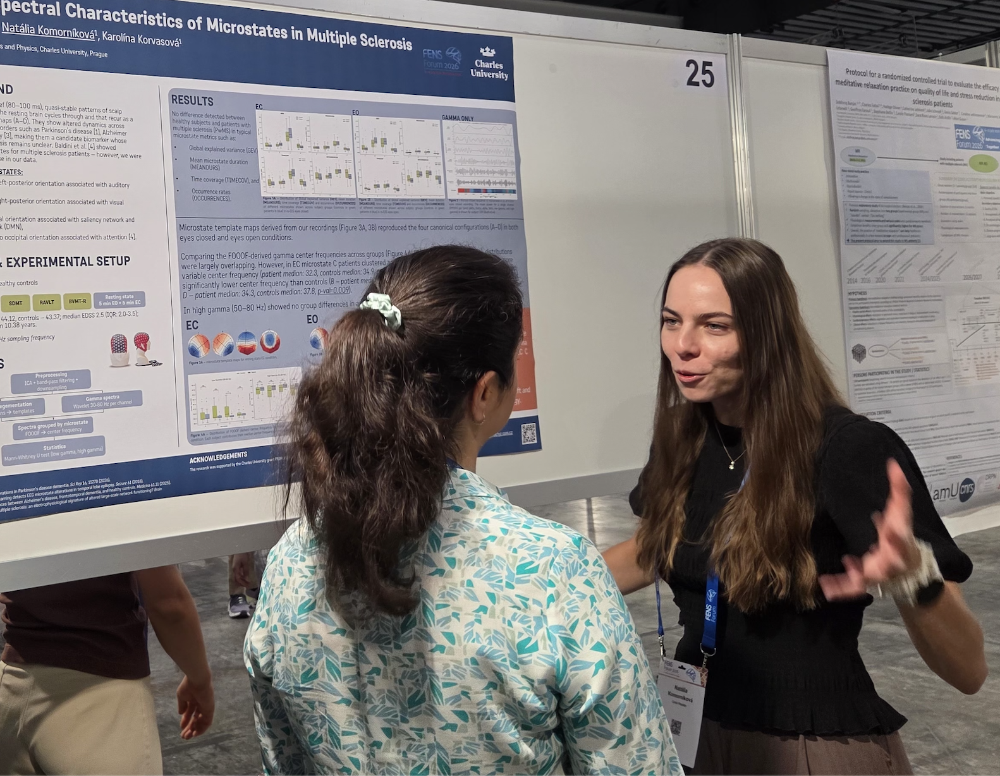
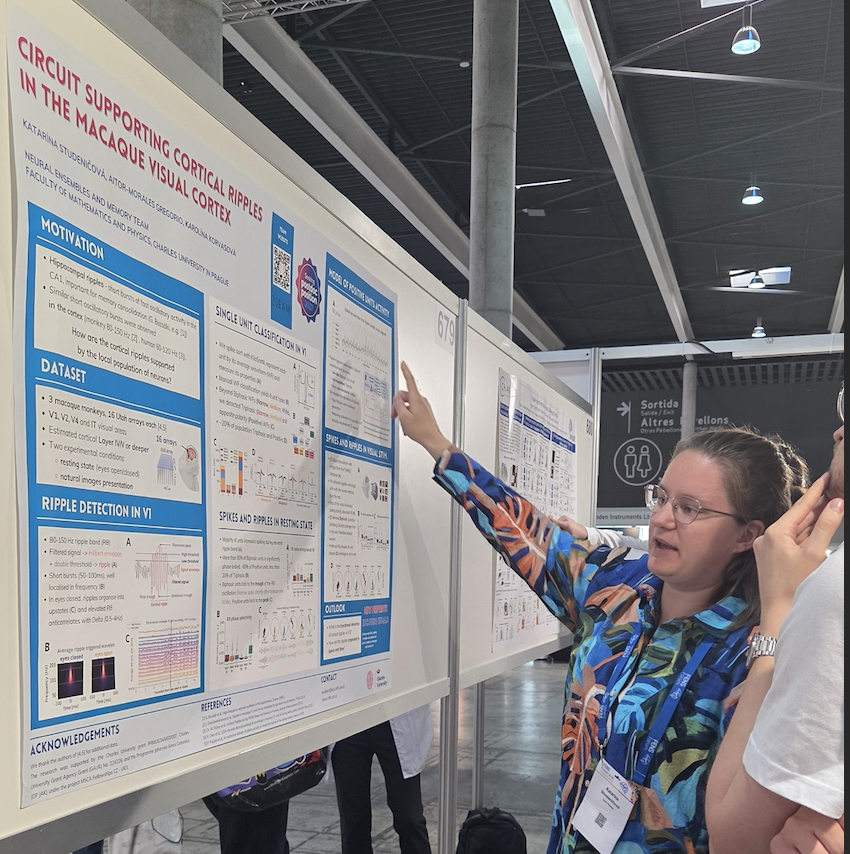
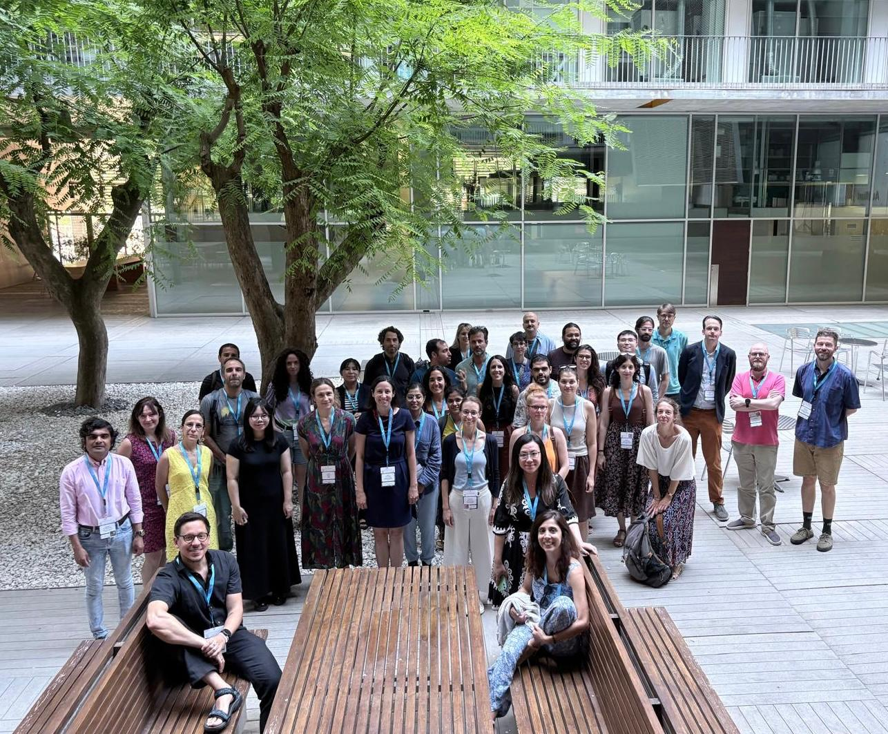

FENS Forum is traditionally on of the most important conferences for our group. It is a huge melting pot of labs, ideas and cultures, and it never made me leave without the feeling that it was worth the time and resources. I also find it very important to bring PhD students with me -- they get to see the European neuroscience landscape and get an overview of what research is being conducted. 

This year, we had two posters presented by Natalia (left) an and Katarína (right). Both girls had very useful discussions with people, sometimes lasting for 30 minutes. In the meantime, I was walking around posters. When I met someone doing related work, I briefly described our results and invited them to the posters. The sessions led to a potential new collaboration and many engaging and useful conversations. 

In general, I found this year's FENS more about discovering new topics, rather than running around tens of relevant presentations. On the other hand, the interactions we had we people that work on similar topics were deep and useful.

{width=55%}
{width=44%}\

Before FENS Started, I took part in the Young PI Symposium. It was an informal event with a lot of fun but also serious conversations about resilience and science advocacy.

Anne Schreiter from GSO Berlin gave a talk on leadership. What I took from it:

* In academia, leadership often means influencing others, rather than having authority over them.
* The most important thing is to be clear about the values and act accordingly, also during the recruitment process. We do not need to fit any boxes how leadership should look like.
* Sometimes being true to your values means being false to your personality (Adam Grant).
* It is useful to have diverse lab - people we guide, coach, train and that we delegate tasks to.

One of the talks was given by Tomás Ryan from the Trinity College Dublin. It is impressive what he achieved in terms of advocacy and interaction with the public and terrifying to hear how tough one needs to be.

* If we do not speak to the public about science-related issues, someone else will.
* If we do not ask the government for money, someone else will. 
* Science will not be of high priority if it is not visible.

During lunch, I decided to sit next to people I did not know and another potential new collaboration stemmed from it. It is very important to reach out to strangers at a conference! 

{width=80%, fig-align="center"}