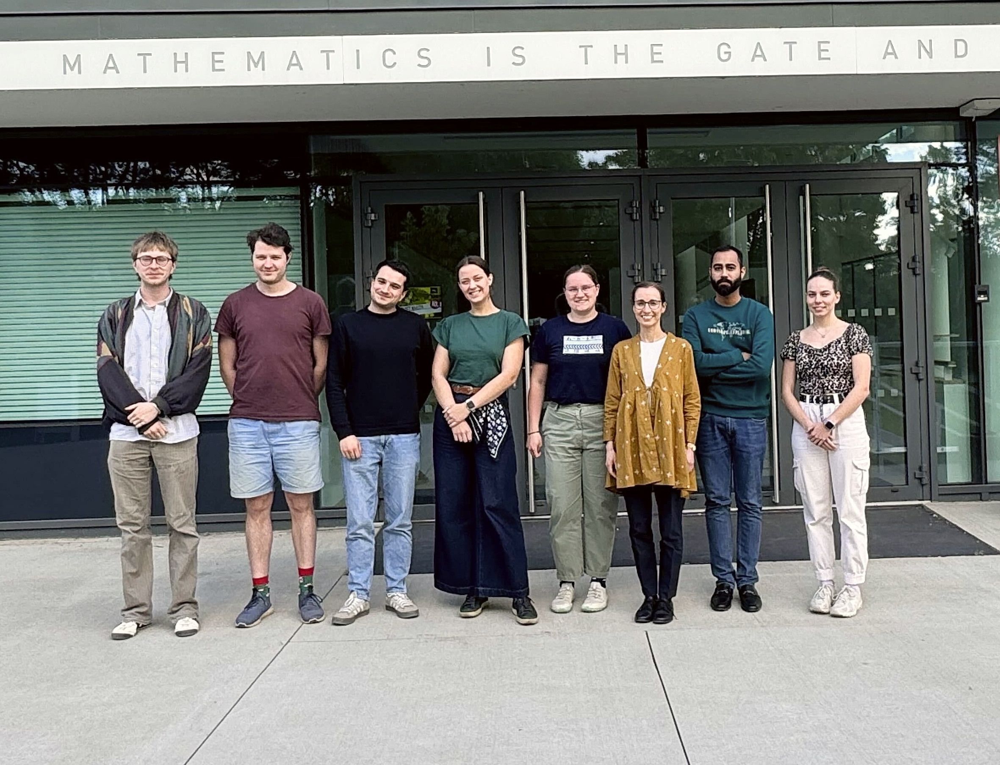
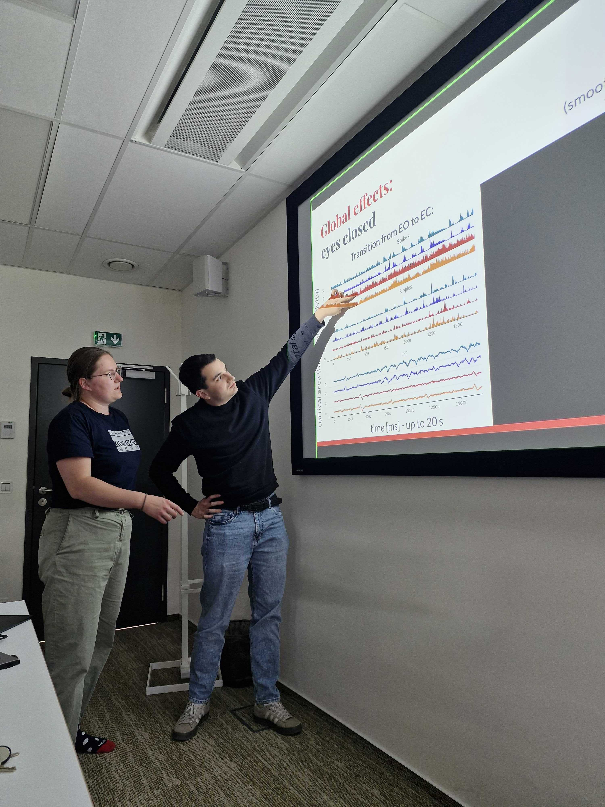
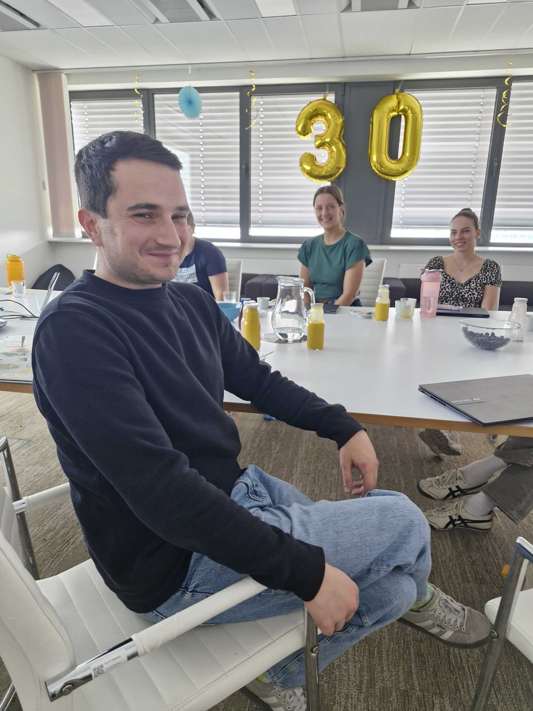
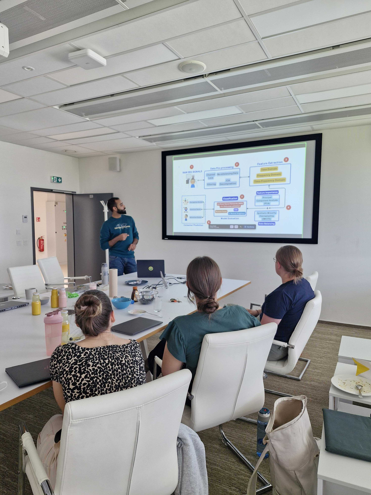
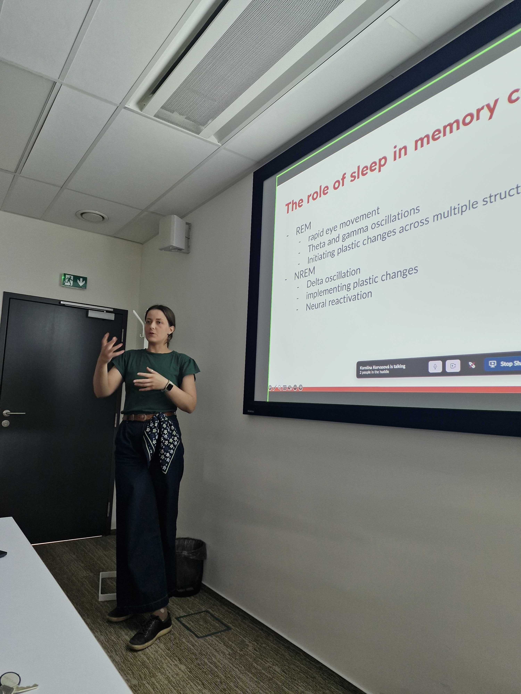
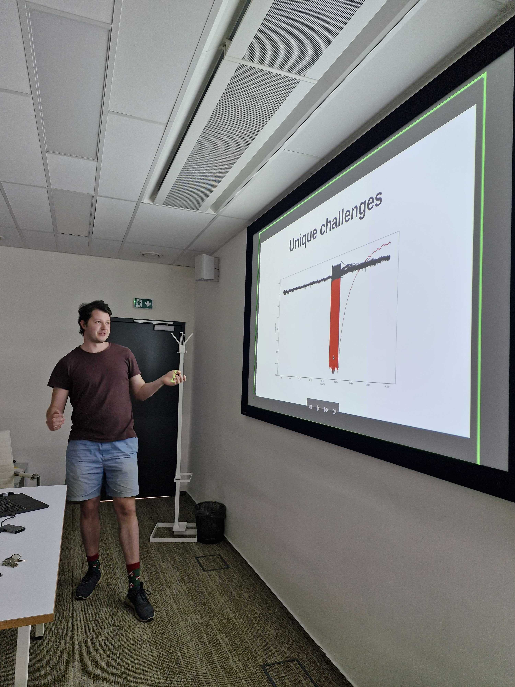
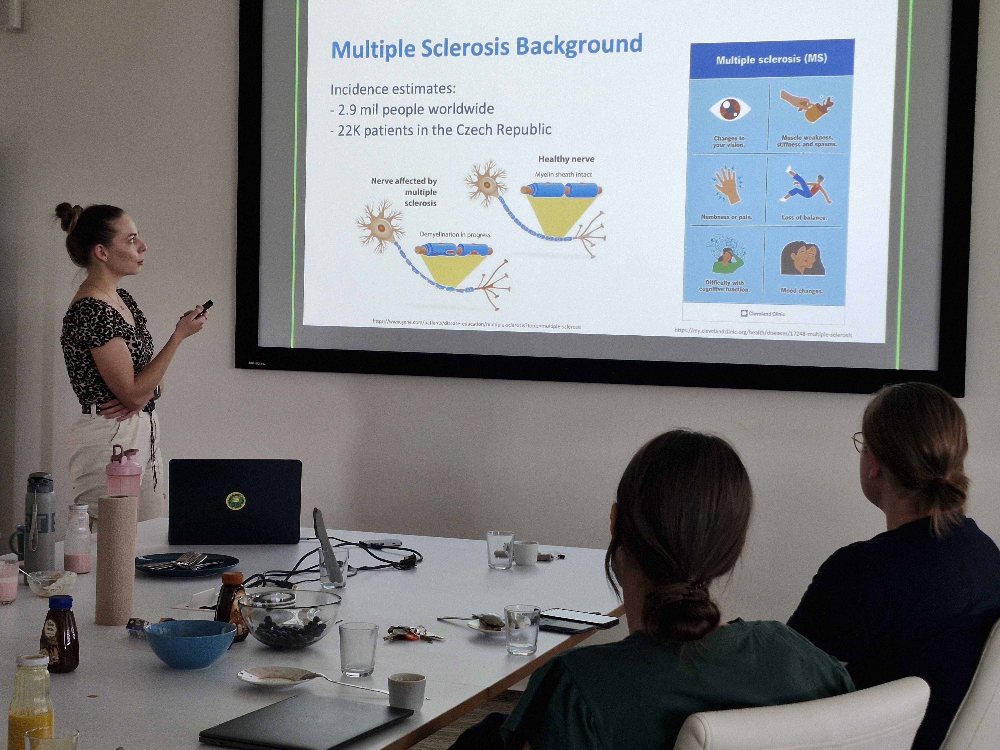
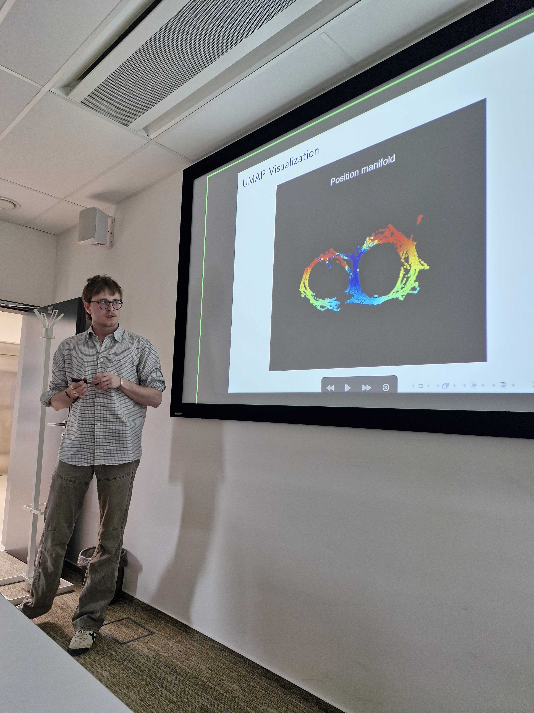

It was very nice to spend an afternoon together and listen to what each member of the group works on. Particularly for the master students who do not regularly attend group meetings, this day was a great opportunity to see the broader context of their work and get feedback from others than their supervisor. Everybody could also get to know Ali Aftab who recently joined the group as a PhD candidate and for Ali to get to know the group.

The day was full with a lot of exciting topics - high frequency oscillations, structure of hippocampal neural activity, all the way to the prognosis of multiple sclerosis. I feel very honored to be working with so many talented and friendly colleagues!

How lucky that we could also celebrate Aitor's birthday on that day! :)

\

{width=35%}
{width=20%}
{width=20%}
{width=20%}

\

{width=20%}
{width=20%}
{width=35%}
{width=20%}

